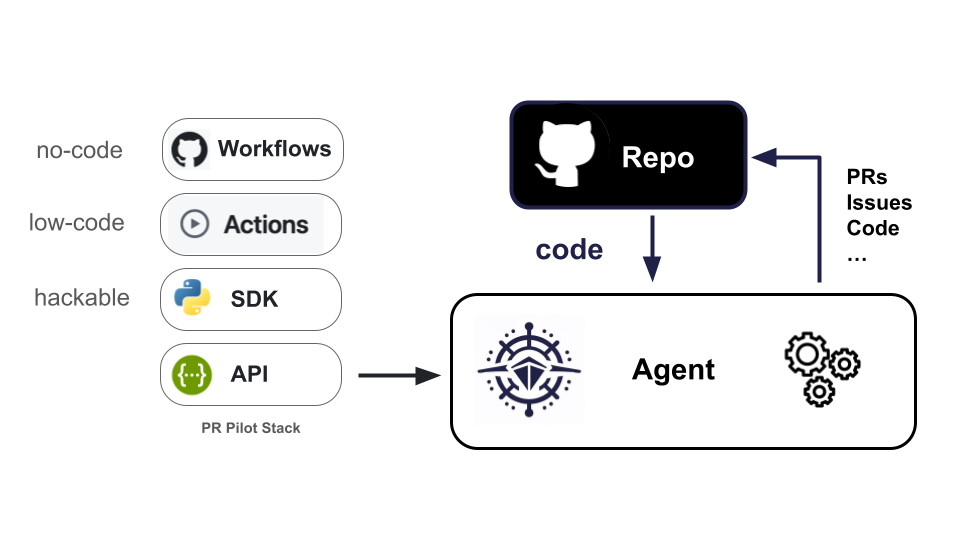

  <a href="https://github.com/apps/pr-pilot-ai/installations/new"><b>Install</b></a> |
  <a href="https://docs.pr-pilot.ai">Documentation</a> | 
  <a href="https://www.pr-pilot.ai/blog">Blog</a> | 
  <a href="https://www.pr-pilot.ai">Website</a>

  A platform that enables developers to create **[agentic workflows](https://github.com/PR-Pilot-AI/smart-workflows)** for Github projects.
  
  
  

Get started now with our **[Project Template](https://github.com/PR-Pilot-AI/smart-project-starter)** and **[User Guide](https://docs.pr-pilot.ai/user_guide.html)**.

